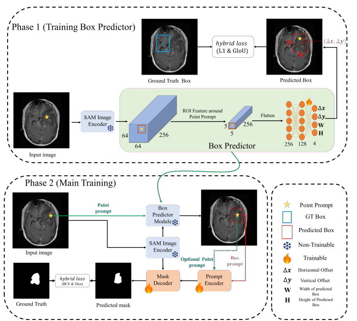
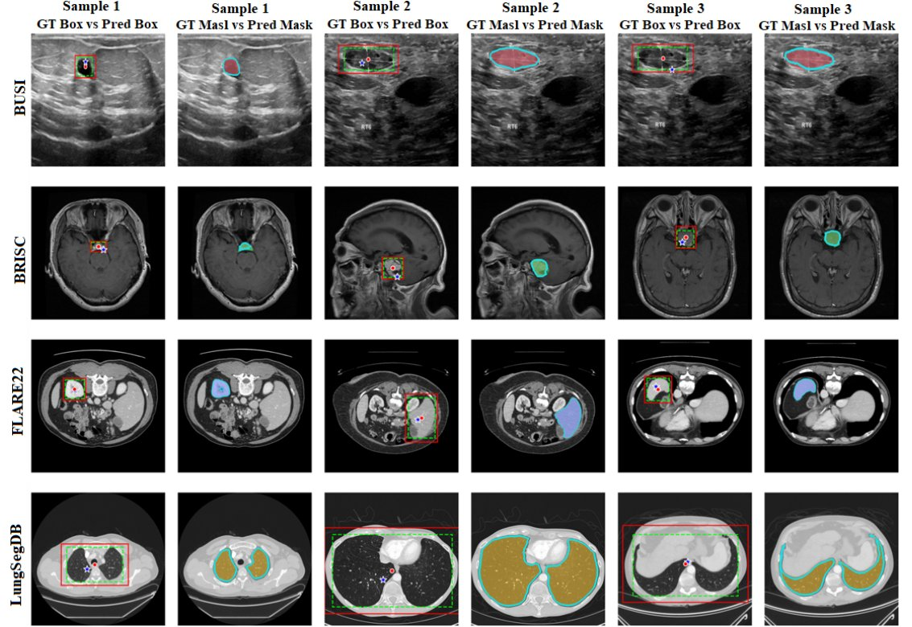

# Point-Prompted Medical Image Segmentation with Automatic Box Prediction

A two-stage training framework built on top of [MedSAM](https://github.com/bowang-lab/MedSAM) that enables automatic bounding box generation from a single point prompt, followed by segmentation mask prediction. Users only need to provide a point click. The model predicts the bounding box and segmentation mask automatically.

<br>

<p align="center">
  
</p>

<br>

## Qualitative Results

<p align="center">
  
</p>

Each sample shows two views: the predicted segmentation mask (left) and the predicted bounding box (right).

| Symbol           | Description               |
| ---------------- | ------------------------- |
| Colored overlay  | Ground truth mask         |
| Cyan boundary    | Predicted mask            |
| Green dashed box | Ground truth bounding box |
| Red solid box    | Predicted bounding box    |
| ☆ Blue star      | User point prompt         |
| · Red dot        | Predicted box center      |

<br>

## Results

| Decoder       | Point |  Box  |      BRISC |  LungSegDB |       BUSI |    FLARE22 | Decoder params | Box pred. params |
| ------------- | :---: | :---: | ---------: | ---------: | ---------: | ---------: | :------------: | :--------------: |
| Frozen        |   ✓   |   ✗   |     0.1053 |     0.0164 |     0.0804 |     0.0568 |       0        |        0         |
| Frozen        |   ✗   |   ✓   |     0.8378 |     0.7258 |     0.7632 |     0.8905 |       0        |       1.6M       |
| Frozen        |   ✓   |   ✓   |     0.7341 |     0.5006 |     0.5743 |     0.8284 |       0        |       1.6M       |
| Trainable     |   ✓   |   ✗   |     0.8745 |     0.9788 |     0.8771 |     0.9169 |       4M       |        0         |
| Trainable     |   ✗   |   ✓   |     0.8793 | **0.9816** | **0.8904** | **0.9314** |       4M       |       1.6M       |
| **Trainable** | **✓** | **✓** | **0.8815** | **0.9816** |     0.8893 |     0.9307 |       4M       |       1.6M       |

<br>

## Setup

### 1. MedSAM Weights

Download the pretrained MedSAM weights from the [MedSAM repository](https://github.com/bowang-lab/MedSAM) and place them under `work_dir/MedSAM/`:

```
work_dir/MedSAM/
└── medsam_vit_b.pth
```

### 2. Data

Place your dataset(s) under `data/`. Each dataset should follow this structure:

```
data/
└── <DATASET_NAME>/
    ├── imgs/        # training images
    ├── imgs_val/    # validation images
    ├── gts/         # training masks
    └── gts_val/     # validation masks
```

> All images and masks should be in **`.png`** format (default expected by the code).

## Citation
If you use this repository in your work, please cite the following paper:
```bibtex
@article{movahedisefat2026enhancing,
  title={Enhancing MedSAM with a Lightweight Box Predictor for Medical Image Segmentation},
  author={Movahedisefat, Amirhossein and Fateh, Amirreza and Mohammadi, Mohammad Reza},
  journal={arXiv preprint arXiv:2606.04705},
  year={2026}
}
